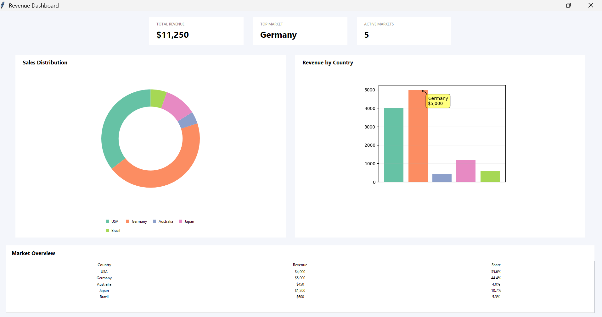
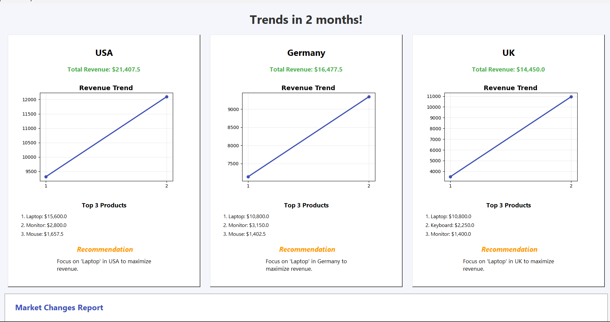

# 📊 Revenue Dashboard (Tkinter)

Interactive desktop application for analyzing and visualizing revenue data using Python.

It allows users to load Excel files and instantly generate insights such as revenue distribution, top markets, and multi-month trends.

---

## 🚀 Features

* 📈 Revenue visualization (bar chart & donut chart)
* 🌍 Market distribution analysis
* 🏆 Top-performing markets
* 📊 Trend reports across multiple months
* 📂 Import data from Excel files
* 📉 Product performance insights
* 🔍 Market expansion & reduction tracking

---

## 🛠️ Built With

* Python
* Tkinter (GUI)
* Matplotlib (charts)
* Pandas (data processing)
* mplcursors (interactive hover info)

---

## ▶️ How to Run

1. Clone the repository:

```bash
git clone https://github.com/USERNAME/revenue-dashboard-tkinter.git
```

2. Enter the folder:

```bash
cd revenue-dashboard-tkinter
```

3. Install dependencies:

```bash
pip install -r requirements.txt
```

4. Run the app:

```bash
python app.py
```

👉 Replace `USERNAME` with your GitHub username.

---

## 📊 Excel Format (Data Structure)

Your Excel file should look like this:

| Date    | Country | Product | Quantity | Price | Revenue | Channels | Customer type |
| ------- | ------- | ------- | -------- | ----- | ------- | -------- | ------------- |
| 2024-01 | Germany | Laptop  | 12       | 850   | 10200   | Online   | B2B           |
| 2024-01 | USA     | TV      | 8        | 1200  | 9600    | Online   | B2C           |

### ✅ Required columns:

* `Country`
* `Revenue`

### ⭐ Optional (recommended for full features):

* `Date` (for trend reports)
* `Product` (for product insights)
* `Quantity`, `Price`, `Channels`, `Customer type`

---

## 📸 Screenshots

### 🏠 Main Dashboard



### 📊 Charts & Market Overview



### 📈 Trend Reports


---

## ⚠️ Notes

* Make sure Excel file has correct column names
* Date column should be in proper datetime format
* Large datasets may slow down performance

---

## 📌 Future Improvements

* Export reports to PDF
* Dark mode
* Database integration
* Real-time analytics

---

## 👤 Author

Adin
